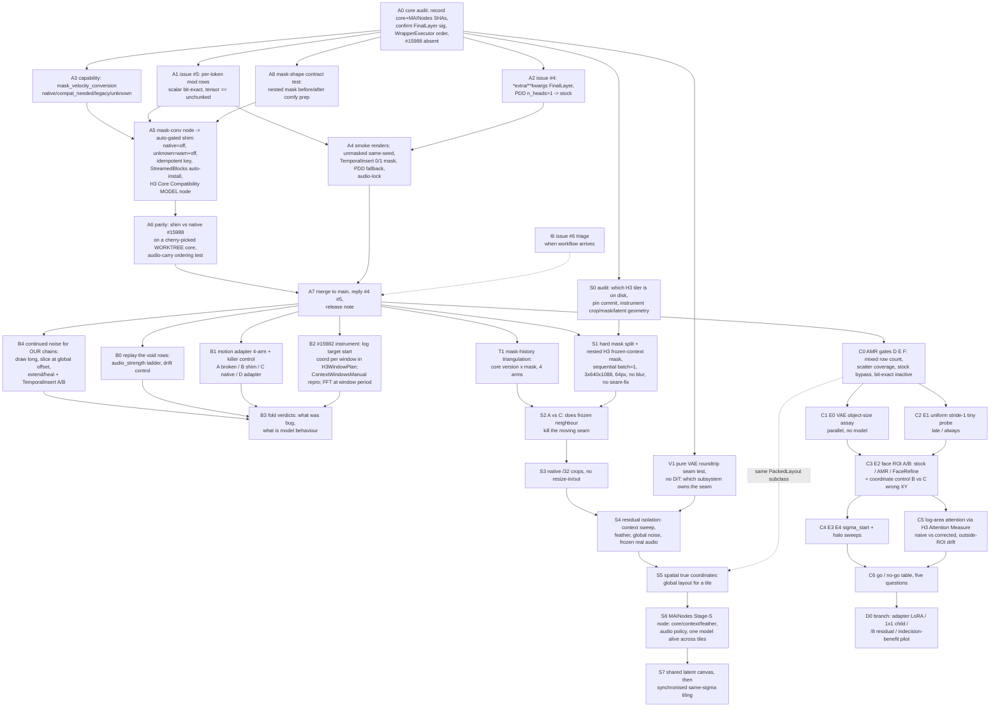

# H3 core compatibility -> mask truth -> spatial AMR: the unified DAG

Written 2026-09-04. One ordering for three packets that arrived together:

- `docs/roadmaps/MAINodes_H3_mask_streaming_core_compat_handoff_2026-09-04.md` (issues #4/#5, #15988 shim, #15982 lead, motion-adapter causality)
- `docs/roadmaps/H3_SPATIAL_AMR_OVERNIGHT_HANDOFF_2026-09-04.md` (stride-1 ROI patches)
- `docs/roadmaps/MAINodes_H3_spatial_context_VAE_pipeline_supplement_2026-09-04.md` (supplement #2: frozen-context tiling, USDU geometry, VAE seams, spatial true coordinates, time-first/space-second)
- the chat analysis tying them together: every one of these is the same rule twice,
  **a token's coordinate and its measure must describe its real physical support**,
  and **once cells get different sampling treatment, every layer between local token
  state and global sampler state must respect that locality.**

The two handoffs are the spec for their nodes. This file is the ORDER, the gates,
and the reminders. When they disagree with what is on disk, disk wins and gets
written back here.

## 0. Ground truth on this box, verified 2026-09-04

| Fact | State |
|---|---|
| ComfyUI checkout | `7d2640b3` on branch `h3-fc-vsa-0829`; BOTH production instances (8188, 8189) run it |
| #15375 per-token masks | present (mod rows may be LongTensor, `mask_row_values`) |
| #15908 PDD FinalLayer | present (`FinalLayer.forward(x, t_emb, video_seg, audio_seg, sigma, sample_sigmas, shifts)`) |
| #15988 mask velocity | ABSENT in core; PR still open, head `238ad33` (the handoff's `bdafd19` is stale, detect semantics not hashes) |
| MAINodes branch | `mask-conversion-0903`, 10 commits ahead of `origin/main`, pushed, not merged |
| `H3 Mask Conversion` node (`h3_mask_conv.py`) | ALREADY the #15988 shim: keyed `WrappersMP.DIFFUSION_MODEL` wrapper, `scope` = both/video/audio, fired-log probe, bit-exact at m=1. Missing: capability auto-off, auto-install from StreamedBlocks, audio-carry ordering test, wrapper-vs-native parity |
| `H3 Attention Measure` node (commit `09fe719`) | per-key log cell-measure bias via appended head dim; the spatial log-area correction reuses it, it is not new work |
| `_fl_forward` in `vram_lab.py:1576` | still the 4-positional form: issue #4 is live here |
| `_mod_scale_shift_range` / `_mod_gate_range` / `_exact_av_rows*` / `_PrecProbe._seg_kind` | still scalar-row: issue #5 is live here |
| `_STOCK_FORWARD_SHA` | `f40e52b23fb2f9c7`, stale on purpose; trim_forward fails safe |
| AMR gates A/B/C | PASS on this core (unfold==patchify; slots stride 4; patch=1 grid nests patch=2 exactly) |
| Local `_forward` shape | prebuilt `PackedLayout` from extra_conds keyed by `(text_len, T, H, W, audio_t)`; per-row timesteps when a fractional mask is present. A mixed spatial packing must own its layout, not just repack rows |
| H3 USDU fork the supplement audits (`lisitskyaa/...Guider_H3`) | NOT installed here. Installed: `Comfyui-MMH3-UltimateUpscale` (bbaudio, 850f4dc) and a latent upscaler from the review tree. S0 must decide which tree to patch |
| H3 VAE (`comfy/ldm/minimax/vae.py`) | `space_down` ratio 16, `time_down` ratio 4, `tile_size=256`, `tile_overlap_min=64`, `tiling=True`, `ViT3DDecoder`. Memory: H3 ignores comfy's generic VAE tiling knobs; standalone decode has no `no_grad` (77-89 GiB OOM) |
| Time-first machinery | `H3TimeSmear`, `H3ExactRecover`, `H3SegmentCrop` in `motion.py`; `H3RepairPlan/Splice` in `h3_repair.py`; crop-refine + shift-12 denoise table in the `h3-spatial-refine` skill. Stage S already has a home |
| USDU H3 fork history (cloned read-only to `ComfyUI-ModelCatalog/reference/usdu_h3`, gitignored) | `8360ef6` 2026-08-16 adds the nested mask (video ones, audio zeros) and RETURNS it; `6836cf3` 2026-08-21 "Audio mask issue fixing" removes only the return. #15375 merged 2026-08-17/18 between them: the same mask went from sampler-only (video all-ones = no-op, audio zeros = sampler blend of an empty template) to MODEL-SIDE (audio rows injected at cond strength from an empty template, per-row labels, audio rescale). The rollback correlates with #15375 first; #15988 (#15981 filed 08-30) is a second, later layer. Reproduce, do not assume |
| Successor tiler (`reference/catr`, GPL-3.0, cloned read-only) | Carries `docs/h3-video-chunking-findings.md`: a full H3 seam investigation dated 2026-08-11/12 on ComfyUI 0.31/0.32, i.e. PRE-#15375. Spatial tile seam 0.2-1.5/255 after DC match, seed-dependent (seed moves it 3x, context_anchor 0.05), overlap width 32->128 null, "seamless on static, unusable on pans". Temporal frozen head WORKS with three levers. VAE round trip costs 1.849/255. H3 does not tolerate latent_t=1 (5-frame floor). Their harness is `tests-AB/run_ab_h3seam.py` |
| Which of those three levers are native NOW | hold anchor: NATIVE since #15375 (`MiniMaxH3.scale_latent_inpaint` injects preserved video at 0.999 clean + rescales audio; Blakeem hand-patched this on 0.32). clean label: NATIVE since #15375 (per-row `t_pin_v = 0.999` for m=0 rows). continued/global noise: NOT native, NOT in MAINodes (no `prepare_noise` or noise-offset anywhere in our tree). Their "untested spatial lever, per-row timesteps for a non-contiguous ring" is exactly what #15375 now provides, so S1 is that experiment |
| Issues open | #4, #5 (FaceRefine author, fix branches offered), #6 (temporal pass smearing, awaiting the reporter's workflow) |
| Void measurements | 169 `audio_strength 0.5` instances and all drift-control rows are void until replayed under corrected mask math (memory card 2026-09-03) |

## 1. The DAG

Arrows are hard dependencies. A dotted arrow is "informs". Nothing in C starts
before A7 because every C render uses masks (V2V strength, ROI hold) and A5/A6
are what make a masked render mean anything.

## 2. Nodes, in execution order

Each node: DELIVERABLE, GATE (what must be true to leave it), THINK (what to
re-read or re-derive at that moment, not before). Effort is wall time on a warm
card, not tokens.

### Phase A: core compatibility (blocks everything)

**A0 core audit** (30 min). Deliverable: `docs/roadmaps/SOURCE_AUDIT_2026-09-04.md`
with `git -C /mnt/work/ai/apps/ComfyUI rev-parse HEAD`, MAINodes HEAD + dirty,
`FinalLayer.forward` signature, the `forward -> WrapperExecutor -> audio carry`
order, presence/absence of the two `out[i] * mask` lines, and which packs patch
`_forward`/`final_layer` (run `h3_capabilities.block_patch_report`). GATE: every
claim in section 0 re-confirmed or corrected. THINK: the upstream PR may have
merged since 09-04; check `gh pr view 15988` first. Read `h3-latent-mechanics`
before touching mod rows.

**A1 issue #5 per-token mod rows** (2 h). Fetch the reporter's branch as a
reference (`git fetch <fork> fix/per-token-mod-rows-15375`), port by symbol, not
cherry-pick: `_mod_row_range`, `_mod_seg_kind`, then `_mod_scale_shift_range`,
`_mod_gate_range`, `streamed_final_layer_forward.head`, `_exact_av_rows`,
`_exact_av_rows_mixed`, `_PrecProbe._seg_kind`. Tests first
(`tests/test_vram_lab_modrows.py`): scalar rows bit-identical to the old helper at
chunk 97/333/1024/4096/16384; tensor rows == unchunked at 128/300/777/1024/16384
including a chunk that straddles the audio/video boundary. GATE: `max_abs_diff == 0`
both ways; a real `H3TemporalInsert` graph gets past step 0 with StreamedBlocks.
THINK: final-layer chunks are segment-relative; do not subtract the segment start
twice. `_mod_seg_kind` reading element 0 assumes the modality tag is constant across
a segment: verify in `rows_to_mod_index` (`row = t_row*3 + tag`) and say so in a
comment.

**A2 issue #4 FinalLayer** (1 h). `*extra, **kwargs` after the four positionals,
captured `_fl/_c/_e` keyword-only, `n_heads = vo.weight.shape[0] // vo.out_features`,
`n_heads > 1 or x.shape[0] < min_tokens` -> `type(_fl).forward(_fl, ..., *extra, **kwargs)`.
Tests: positional AND keyword calls leave captures intact; PDD mock (>1 head) reaches
stock with sigma/sample_sigmas/shifts; single head streams. GATE: tests pass; a
PDD LoRA render (we have the PDD-Mamad8 pack and a PDD LoRA on disk) completes and
matches stock. THINK: quantised/proxy weight types may not expose `.weight.shape`
the same way; if detection cannot be proven, fall back to stock, never stream.

**A3 capability state** (1 h). Extend `h3_capabilities.probe_core` with
`mask_velocity_conversion` in {native, compat_needed, legacy_no_model_mask, unknown},
inspecting `MiniMaxH3Model.forward` source only (not the module), requiring BOTH
multiplications for native, requiring `WrapperExecutor` + carry-after for
compat_needed, and returning unknown on foreign ownership. Fixture tests for the
six cases in the compat handoff s.6.3. `format_report` line. GATE: never
`compat_needed` when another implementation could already scale. THINK: this
detector is the only thing standing between users and `mask^2 * v`; over-caution
is correct here.

**A8 mask-shape contract test** (30 min, needs only A0). Record the nested (video, audio) mask shape and dtype before and after comfy's mask preparation and `_pool_masks_to_token_grid` on this exact core, for a 5-D video latent and the audio latent. The successor tiler normalises to a single-channel broadcastable form because channel-expanded masks get re-prepared wrongly; the USDU fork used `ones_like(video_latent)` (channel-expanded). Pin which form H3 wants. THINK: this is the cheapest test in the plan and it de-risks S1, TemporalInsert, and every mask the AMR ROI will build.

**A5 the shim grows up** (2 h). `h3_mask_conv.py` already does the math; add:
consult A3 (`native` or `legacy` -> no-op with a report line; `unknown` -> warn,
no-op; `compat_needed` -> install), `remove_wrappers_with_key` before add so
repeated application is idempotent, auto-install from `H3StreamedBlocks` (one
helper, two entry points), and a `H3 Core Compatibility (alpha)` MODEL->MODEL node
for `H3TemporalInsert` graphs without StreamedBlocks. Keep `mode=on/off` and `scope`
as the research override; the new default is `auto`. GATE: node tests from compat
handoff s.6.4 (no mask, video only, audio only, both, idempotent, native, legacy,
unknown). THINK: install ORDER. The SLA pack's executor.original() drops every later
wrapper (memory: sla-skips-later-wrappers). The shim must be installed before SLA
in the graph, and the fired-log is how you prove it ran. Do not restart 8188/8189
for this; use the lab rig or 8190.

**A6 parity against native** (2 h + one render). Cherry-pick the current #15988
head onto a WORKTREE of core (`/mnt/work/ai/apps/ComfyUI-v031` pattern, own venv,
port 8190), never onto the production checkout. Run the same tiny forward with
(a) stock core + shim, (b) patched core + shim auto-off. Also the audio-carry
ordering unit test: video shift 12, audio shift 3, audio_scale != 1, non-uniform
audio mask, mask BEFORE carry. GATE: (a) == (b) exactly at the tensor level; same
seed real render same hash. THINK: same-card rule, cold process, one instance per
card; a diff here means the shim is wrong, not the core.

**A4 smoke renders** (one evening, unattended, launch first). Via
`benchmarks/scripts/queue_scene.py` only: unmasked same-seed stock vs StreamedBlocks
(must be bit-identical), TemporalInsert 0/1 mask with and without StreamedBlocks,
PDD + StreamedBlocks (fallback path), an audio-lock graph. GATE: all complete, ledger
rows present, vram sampler up. THINK: GPU works first; queue these before writing
A7's prose.

**A7 merge + replies** (1 h). Merge `mask-conversion-0903` to main after A1-A6,
reply on #4 and #5 with what was taken and what changed (the `**kwargs`, the
capability gate), release note. Leave `_STOCK_FORWARD_SHA` stale and say so in the
note. THINK: grep the diff for handles before pushing (house rule: no community
names in committed docs; repo URLs as citations are fine). The compat handoff names
the reporter as a person throughout: operator's call whether it is committed as-is,
scrubbed, or kept local.

**I6 issue #6 triage** (when the workflow arrives). Reproduce on the simple example
first. Candidate causes in order: their graph carries a fractional mask on
pre-#15988 core (A5 fixes), StreamedBlocks on a masked graph (A1), or plain settings.
THINK: do not diagnose from screenshots; ask for the graph, which you already did.

### Phase B: re-measure what the bug contaminated

**B0 replay the void rows** (one night). The audio_strength ladder and the drift-control
rows from memory card `fractional-mask-conversion-15988`, same seeds, shim on, both
scopes. GATE: every replayed row has a ledger entry and a `mc_on` tag. THINK: same
seed after the fix is a DIFFERENT TAKE (G0 pair 1 result); rank by the meters, not by
distance to the old render.

**B1 motion adapter four-arm** (one night). One held-out fast-motion clip from the
adapter evaluation, same seed/plate/hold map/sampler/steps/inject/pins. Arms A broken,
B shim, C native worktree, D shim + adapter. Killer control E: a path where H3 never
sees a non-trivial mask, adapter off/on. Metrics: alternation, rate, jitter,
entry/exit jank, invented objects, the #15981 latent-cell FFT. GATE: B == C
(else stop, shim wrong); E shows advance/snap without the adapter. THINK: chronology
already says #15988 cannot be the adapter's origin (08-15 measurements predate
#15375's 08-18 merge); the question is only how much residual it explains. Playback
judges, meters sort.

**B2 #15982 instrumentation** (half day). In `H3WindowPlan`/segment-crop graphs, log
per window: world start/end, local start/end, target `_video_t_grid` origin, ref
coordinates, True Clock spans, whether any Comfy context handler is active. Then a
`ContextWindowsManual` reproduction and the temporal-difference FFT at the window
period. GATE: a table saying whether our windows share a target origin AND whether
changing it moves the window-period power. THINK: a local subclip with a local origin
is legitimate if all its conditioning is local; this is instrument-first, patch never,
until the table exists.

**B4 continued noise for our own chains** (half day + one night). Neither core nor MAINodes draws one long noise field and slices it at a global offset; every chunk at the same seed restarts the field at its join. The successor's measurement on a 5-frame frozen head: DC blue +1.37 -> +0.13, green +2.11 -> +0.78 from this alone. Build it as a noise provider node (seed, global length, offset), then A/B on the extend/heal reference chain and on a TemporalInsert render. GATE: same-seed identity when offset=0 and global length equals local length. THINK: this is the one lever from their frozen-head recipe that did not go native with #15375; hold-anchor and clean-label already did, so do not re-implement those.

**B3 fold** (1 h). One page: which effects were the bug, which are model behaviour,
what the adapter still earns. Prune the verdict queue the moment a ruling lands.

### Phase C: spatial AMR (the AMR handoff is the spec)

**C0 gates D/E/F** (2 h). D mixed row count + anchor00 coverage (every cell written
exactly once), E stock bypass calls the original `_forward` object, F inactive
wrapper bit-exact to stock on a real tiny render. Build the prototype as
`h3_spatial_amr.py`: a `PackedLayout` subclass that owns a longer video segment plus
overrides at the three video-row sites (pack, position ids, scatter), NOT a full
`_forward` copy. GATE: F passes or nothing downstream is interpreted. THINK: refuse
when a foreign `_forward` patch is present; refuse v0 unsupported payloads loudly;
the v0 "no denoise mask while active" restriction collides with V2V strength here,
so decide early whether v0 is T2V-only or A1's per-row timesteps carry into the
mixed segment.

**C1 E0 VAE assay** (parallel with C0, no model). Faces/hands at 24-192 px through
encode/decode, per-size breakpoint. THINK: latent targets never from mp4; encode
live; identity meter is C-RADIOv4, not InsightFace.

**C2 E1 uniform stride-1 tiny probe** (one hour of GPU). 5 frames, small square,
stock / late / always. THINK: this is a smoke test, not a benchmark; if both are
catastrophic, check position ids, row order, scatter, modulation segments before
declaring the idea dead.

**C3 E2 face ROI A/B + coordinate control** (one evening). Stock / AMR halo 1
sigma_start 0.85 / FaceRefine. Add the chat's control: B stride-1 with correct XY vs
C stride-1 with deliberately rebased XY. B >> C reproduces #15982 spatially and is
the cleanest possible proof that coordinates, not density, carry the effect. THINK:
reference-scene rule (test against what shipped), corpus-bias check, judge in
playback, quality over wall clock.

**C4 E3/E4 sweeps** and **C5 area-weighted attention** (reuse H3 Attention Measure:
coarse w=1, fine w=1/4, text/audio 1; cite ToMe proportional attention, ToMA, ToSA,
this is not novel). Both only if C3 is coherent. THINK: never materialise NxN; the
appended-head-dim trick already avoids it.

**C6 go/no-go** answers the AMR handoff's five questions with the s.23 table filled.

### Phase S: spatial context and tiling (supplement #2 is the spec; sibling of C, same gate)

Runs beside Phase C on the other card (ruling 09-04: separate cards, independently
reproducible, first C+S integration only after each beats its own baseline). Gate is
per-experiment, not per-phase: S0, V1, A8, layout tests, and the noise-field
infrastructure need only A0; anything that hands H3 a denoise mask waits for A7.
S5 and C0 share one piece of code.

**S0 two-repo audit** (2 h, needs A0 only). Ruling 09-04: the behavioural fixture
is the USDU H3 fork (pin `6836cf3` current and `8360ef6` historical), installed into
the LAB tree only, never production custom_nodes; the design reference is the
successor tiler; neither becomes the long-term owner, the deliverable lands in
MAINodes. Read `reference/catr/docs/h3-video-chunking-findings.md` in full first;
it is the only measured H3 seam study we have and it predates #15375, so re-derive
which of its levers are now native (table in s.0) before copying any of them.
Derive editability from core/crop/history geometry, never from the fork's
`ProcessedRegionTracker` (initialised None; CONTEXT_ONLY silently skips without it).
Instrument: crop region, actual crop size, processing size, encoded latent shape,
mask min/max/unique, committed core, tile order. THINK: survey installed packs
first; the installed pack may already do some of this.

**S1 frozen-context MVP** (2 h). Save hard masks before any blur; nested H3 mask
(video: 0 on finished neighbour, 1 on core; audio: explicit policy), NEAREST only,
binary, /32-aligned; static over all latent time; remove the H3 exclusion;
force sequential batch=1; 3 full-height 640x1088 cores, 64 px context, no seam-fix,
no mask blur. GATE: the mask actually reaches the sampler (log it) and the shim's
fired-log shows it ran. THINK: masks snap to tokens (repair-verb rule);
`mask_row_values` amax-pools per 2x2 patch so a seam through a 32 px row makes the
whole row live; frozen is token-level, the VAE spreads decoded content across the
boundary (memory: frozen-is-token-level), so expect a residual VAE band even when
the diffusion seam is gone.

**T1 mask-history triangulation** (one evening, after A7). The variable is
core version x mask, not just mask. Arms: (1) `6836cf3` as shipped, no mask;
(2) `8360ef6` mask returned on current core (video ones, audio zeros: empty audio
injected clean); (3) arm 2 + the #15988 shim; (4) arm 3 + the S1 frozen-neighbour
video mask. Optional (5): arm 2 on a pre-#15375 worktree to reproduce the fork's
original working state. GATE: says separately whether #15375/#15988 explain the
rollback and whether frozen context moves the seam. THINK: the "audio mask issue"
most plausibly is empty-template audio rows arriving at cond strength; log the
audio rows' label and content, not just the video.

**S2 A vs C** (one evening). Two seeds minimum: the successor measured the H3 tile
seam as seed-dependent (3x) and context_anchor as non-replicating across seeds, so a
one-seed win is not a result. Prefer pan/action content (their "unusable" regime;
the panrun reference scene qualifies). Same clip/seed/schedule/denoise. Arms: A current,
B mask attached only (video all-ones, audio frozen empty), C B + hard frozen
neighbour, D C + 8/16 px feather. Seam metrics at x=640/1280 over time (gradient,
flow discontinuity, their temporal derivatives) with control columns away from the
seam; side-by-side + 8x crop + temporal difference view. GATE: A vs C answered in
playback. THINK: B is a diagnostic, not a design; it freezes an EMPTY audio
template and that can change video conditioning.

**S3 native geometry** (2 h + rerun). Move H3 detection before the resize decision,
/32-aligned crop, no LANCZOS either way, commit only core. Rerun S2's clip.

**V1 VAE roundtrip** (needs A0 only, no DiT, promoted ahead of every masked render; prior 1.849/255 per round trip). Source -> encode -> decode at stock
tiling, larger overlap, halo/commit-interior prototype, whole-frame gold where
VRAM permits. Map seam energy to diffusion boundaries vs the VAE's 256/64 tiling
vs composite boundaries. THINK: the decoder is a ViT, no finite conv halo gives
exact parity, sweep it; wrap decode in no_grad; comfy's tiled-decode widgets do not
reach this VAE.

**S4 residual isolation**, in order and one at a time: context 64/96/128 (prior:
null in their data); feather; global noise field cropped per tile (prepare once at
global latent shape, /32 crops, same sigmas; first-class in the S6 design, per-tile
noise stays as the control); anchor-vs-overlap source: (a) finished neighbour frozen
to the core edge, zero shared diffused band, (b) frozen anchor + shared overlap taken
from the RAW source, (c) re-diffuse the finished neighbour's band (double VAE+diffusion
in series, expected worst); frozen REAL audio (encode the chosen performance once, reuse for every
tile, audio mask 0, never return Stage-S audio unless asked). THINK: audio is the
product elsewhere in this program; Stage S must not silently replace it.

**S5 spatial true coordinates** (half day, only if S4 leaves a motion warp). Build
the tile's `PackedLayout` from the FULL global frame grid and slice the tile's
rows; audio rows take the global w extrema. Layout tests: full-frame crop == stock;
the same global row in two overlapping tiles has identical ids; adjacent crops are
monotone at the boundary; refs unsupported or correct, never silent. THIS IS THE
SAME LAYOUT SUBCLASS AS C0: one class that owns the target-video row set and its
position ids, parameterised by (global extent, local crop, stride map). Build it
once. THINK: this is a MAINodes extension, not an upstream bug claim; #15982 is
the temporal twin.

**S6 MAINodes Stage-S node** (after S2..S4 are understood). Semantic knobs:
core width, context_anchor_px, live_overlap_px (default 0), output_feather_px
(default 0), traversal (linear / center-out), spatial_coordinate_mode
(local / global_experimental), audio_context_mode (empty_locked / original_locked /
recovered_pass_locked). One model/guider/VAE alive across the loop; exact frame
count; every tile reports global coordinates. Acceptance list: supplement s.21.

**S7 shared latent canvas, then synchronised same-sigma tiling** (P4). Encode once,
commit tile latents into one canvas, decode once; then step all tiles one sigma at a
time against the shared canvas. Not before S6 exists and the seam data says the VAE
boundary still matters.

**Time first, space second** binds all of S: Stage T (smear -> de-rope ->
decode -> ExactRecover) emits real frames; Stage S consumes only those. Never run
high-res spatial work over dilation frames ExactRecover will discard; USDU hiding
the VAE node does not hide the VAE.

### Phase D: branches (one, chosen by C6)

Adapter LoRA (foveated precedent) / true 1x1 child decomposition / sparse /8
residual / indecision-benefit pilot. Not planned further until C6 exists.

## 2b. Design principles carried across every node (from the 09-04 synthesis)

1. **Carry cell geometry, not indices.** A token is `(x, y, t, dx, dy, dt)`. #15982's
   second finding (the causal-window fix treats one latent row as one uniform
   timestep while the VAE groups frames 1,4,4,4,4) is the temporal version of the
   mistake AMR would make spatially. So `SpatialRowMeta` in C0 carries the anchor
   AND the support size from day one, and the measure `dx*dy` is what C5 feeds
   into H3 Attention Measure. Never let "position = ordinal index in the packed
   sequence" creep back in.
2. **Coordinates before quality.** C3's B-vs-C control (same latent information,
   correct vs rebased XY) runs BEFORE any sweep. If B is not clearly better than C,
   nothing in C4/C5 is interpretable.
3. **A tiny AMR adapter is an EXPECTED outcome, not a failure.** The temporal
   precedent is exact: de-rope works conceptually, base H3 goes advance/snap
   out-of-distribution on the stretched clock, the motion adapter fixes it.
   Foveated Diffusion found the same for mixed spatial resolution. If C3 shows
   more detail plus boundary instability, that is Case C in the AMR handoff and
   routes to D0 (mixed-lattice LoRA), not to "kill".
4. **#15375's per-token rows are plumbing for local adaptive computation.** Once A1
   slices them correctly through streamed chunks, `sigma_j = f(indecision_j)` and
   per-region solver effort are one more row vector, not a new architecture. Keep
   A1's helpers general (any per-token vector, not just modulation rows).
5. **#15982 placement.** The chat put "global temporal coordinates correct" under
   core correctness; this DAG puts it in B2 as instrument-first, because our
   burst windows may legitimately use a local origin and the compat handoff
   forbids merging an offset without a MAINodes-specific reproduction. It is a
   gate for Phase C only in the sense that C3's coordinate control is the same
   principle; it is not a blocker for A7.
6. **Five ownership classes, five rulers.** Diffusion/context drift (frozen
   context), coordinate/RoPE drift (#15982 in time, S5 in space), noise-field
   discontinuity (B4/S4 global noise), VAE/codec crop framing (V1), and
   compositing/photometric mismatch (hard vs soft mask, native geometry, DC).
   A motion seam is a symptom of any of the first four, never a sixth cause. A seam report names a
   symptom, not a family; V1 and the seam-position map assign the family before
   anything is "fixed".
7. **Hard model mask is never the soft output feather.** A Gaussian tail of 1e-4
   thresholded at >0 makes a row fully live. Sampling/freeze semantics and blend
   semantics are separate tensors with separate knobs, in S1 and in C0's ROI mask.
8. **One subproblem abstraction, as a value object.** `WorldViewSpec`: world
   extent (global t, x, y) / crop extent / position transform local->global /
   editability (hard ownership) / context source (raw, live, finished neighbour) /
   noise mapping (global-coordinate field) / latent mapping (pixels <-> VAE <-> rows).
   One `H3LayoutAdapter` consumes it; a `WritebackPolicy` (owned core, overlap,
   feather, DC) sits downstream, never inside it. Immutable value + adapter, not a
   subclass hierarchy. De-rope, temporal insert, tiles, ROI refine, and windows are all
   instances. Do not build the framework before S2 and C3 report, but name every
   new interface in these terms so it folds later.

## 3. Reminders by moment

**Before touching core or a wrapper**: `systemctl --user is-active orithra-comfyui@workstation orithra-comfyui@maxq`; never hand-start on 8188/8189; worktree for any core change; `custom_nodes` is live, a checkout changes the next restart; survey installed packs first (grep custom_nodes before claiming the field lacks something).

**Before any render**: queue_scene.py only; vram-sampler active; `/free` before big VRAM jobs and host RAM is the real ceiling; lab is always fenced (`start_lab.sh --ram/--vram`); same card for timed comparisons; cold process for anything you will publish; do not kill in-flight renders, queue behind them.

**Before writing a number**: measure, then write the sentence; null gate with an absolute bar (euler reruns are bit-exact, so any diff is real); sibling-take band is take-noise, never rank by same-seed distance; error family needs its own ruler; verify fast motion in playback; check `execution_cached` before subtracting two runs.

**Before a push**: which side am I on (MAINodes public, ModelCatalog/h3 private); grep the diff for handles and the subway prompt; `git -C` per repo, never a bare `git add -A`; widget order is append-only.

**Before declaring a phase done**: the acceptance list in compat handoff s.12 for A; the AMR s.11 win/no-go cases for C; every render has a ledger row; the report separates implemented / verified / not claimed.

## 4. Do not

Refresh `_STOCK_FORWARD_SHA`. Suppress model-side masks as the general answer
(FaceRefine's workaround is an alternate algorithm, not our fix). Put the audio
multiplication after the carry. Install the shim when native or unknown. Merge a
#15982 offset without B2's table. Retire the adapter on theory. Start Phase C on a
core whose mask math is unverified. Train anything before C6. Judge masked tiling on pre-#15988 core. Use output blur as the freeze mask. Treat `seam_fix=None` as a defect (prevention beats a repair pass). Spatial-batch context-dependent tiles and call them anchored. Assume comfy's tiled-decode widgets control H3's internal VAE tiler. Call local spatial RoPE an upstream bug.

## 5. Open for the operator

1. Commit the compat handoff as received (names the reporter as a person), scrub, or keep local?
2. Reply to #4/#5 now with "taking both, capability-gated" or after A7 lands?
3. v0 AMR: T2V-only, or carry A1's per-row timesteps into the mixed segment from the start?
4. RESOLVED 09-04: fixture = USDU H3 fork in the lab tree, design reference = successor tiler, owner = MAINodes.
5. RESOLVED 09-04: separate cards, independent baselines, integrate only after both pass.
6. The successor tiler is GPL-3.0 and its H3 study is the closest prior work to Phase S and B4. Cite it in the release note when B4/S ship? (our repos are GPL-3.0 too, so code reuse is licence-compatible, but the house rule prefers rebuilding from our own example)
